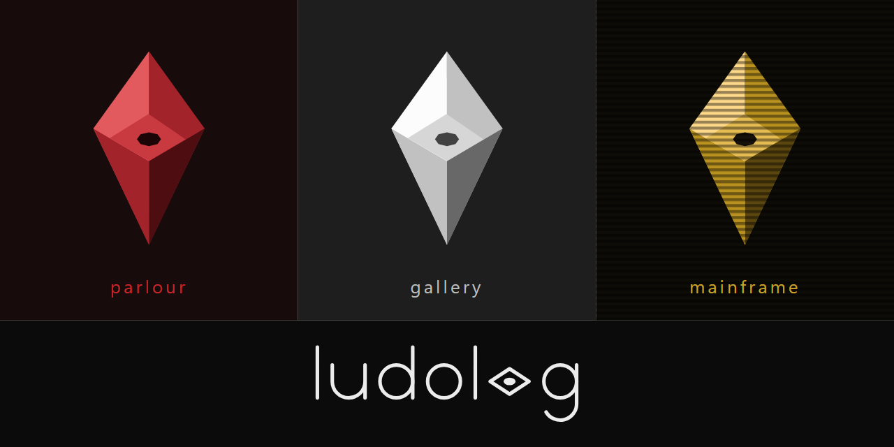
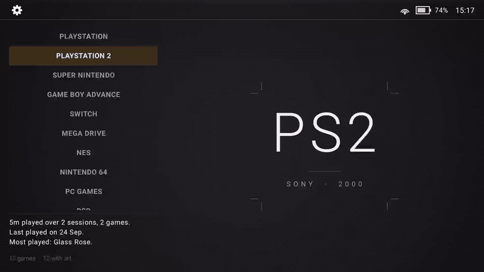
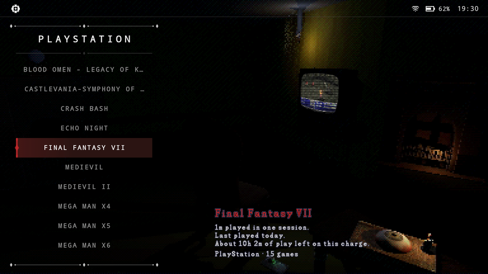
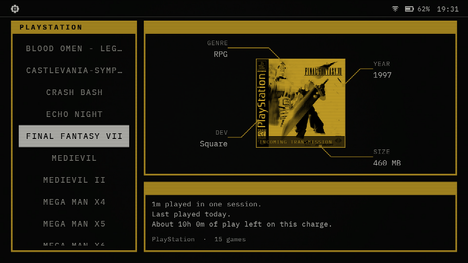
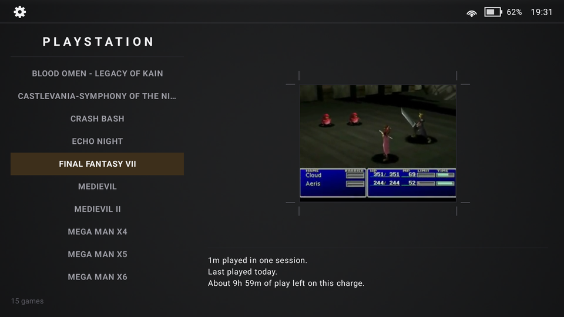
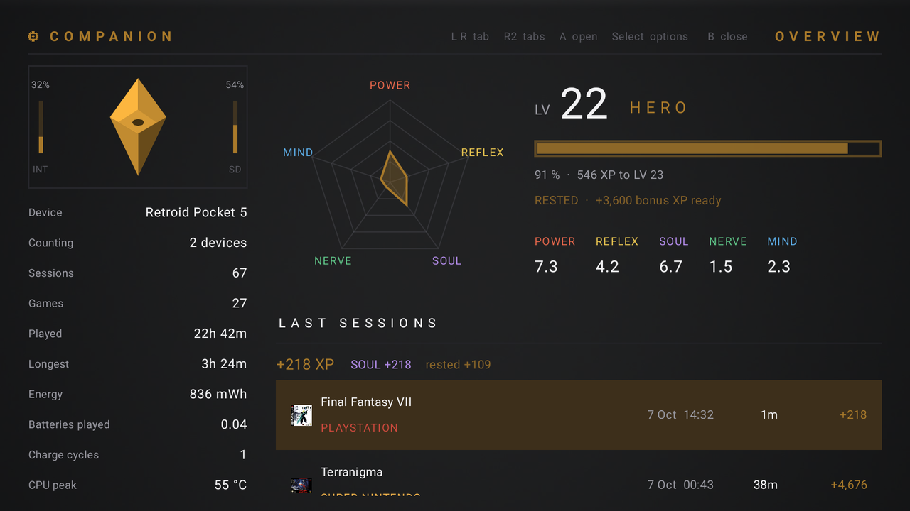

# Ludolog

**v0.6.1** · A front-end for Android retro handhelds. Your games sorted by console and opened in the
right emulator, with box art, video previews and themes, plus a Companion that turns what you play
into a character.

## Features

- **Your games, sorted.** Point Ludolog at your ROM folders and it sorts them by console,
  recognising each game by what's inside the file, even when its name is wrong.
- **Press A to play.** Each game opens in the right emulator. About 40 are supported, from
  RetroArch cores to standalone emulators and PC game launchers.
- **Box art and videos.** Covers and gameplay previews are fetched for you, and a free game catalog
  adds names, genres, release dates and synopses.
- **Find any game.** Search every console at once by part of its name, with Y or the magnifier at
  the top, and pick up where you left off from Recently played, at the top of the list.
- **Made for handhelds.** Built for a gamepad, works with touch, adapts to any screen shape and to
  dual-screen devices, and can be your home screen. With a second screen, the list goes on one and
  the room and the game on the other, and you can swap them: with a TV, the picture goes big. A game
  opens on the screen with the picture and Ludolog stays on the other, where you can keep browsing or
  open another app; tap a touch screen three times to move the controls to the other screen.

### Three themes

| Parlour | Mainframe | Gallery |
|:---:|:---:|:---:|
|  |  |  |

Each theme has its own look, sounds and spinning consoles. Gallery comes with the app; Parlour and
Mainframe are a quick download from the welcome screen or Settings.

### The Companion

Ludolog keeps a logbook of everything you play and turns it into a character. Its five-sided
profile grows with the kinds of games you play, and it gains levels, a class, achievements and
missions along the way. Open it with L2 + R2.

### Better with Ludolog Link

[Ludolog Link](https://github.com/monkikolab/ludolog-link) is an optional companion app. It shares
saves and Companion sessions between your handhelds, and lets you manage games, art and backups
from a Windows PC.

## Install

1. Download the APK from the [latest release](https://github.com/monkikolab/ludolog-front-end/releases/latest)
   and open it on your device.
2. Open Ludolog. The welcome screen sets up the rest: where your games are, the game catalog, the
   themes and, if you like, Ludolog Link.

## Still in testing

Ludolog is young. So far it has been tried on an AYN Odin 3 (Android 15) and a Retroid Pocket 5
(Android 13), with RetroArch, DuckStation, AetherSX2 / NetherSX2, ARMSX3, Dolphin, PrimeHack,
PPSSPP, Azahar, Eden, GameNative, GameHub Lite and DoomForge. Other emulators are set up but
untested. Expect rough edges, and please
[report what you find](https://github.com/monkikolab/ludolog-front-end/issues).

## Privacy

Ludolog has no accounts, ads, analytics or tracking. It goes online only for:

- **GitHub**, to download the game catalog and the themes from this project's releases, and to
  check for a newer Ludolog (this can be turned off in Settings, Data).
- **Box art and videos**: libretro-thumbnails, GameTDB, the Steam store (for PC games) and
  gameplay-video collections on archive.org. Only the game's name or ID is sent.
- **IGDB**, only if you add your own keys. They are kept encrypted on the device.

Your settings, art and logbook stay in Ludolog's folder on your device. Ludolog Link, if you use
it, talks only to your own devices and PC on your local network. The diagnostics file is saved to
Download for you to attach to a bug report; nothing is sent on its own.

## Support the project

Ludolog is free, made in spare time. If you'd like to help it keep growing (more themes, more
emulators, more devices tested), you can buy me a coffee on
**[Ko-fi](https://ko-fi.com/monkikolab)**. Bug reports and feedback help just as much.

## AI assistance disclosure

AI assistance was used while building this project. I reviewed the code throughout development and
understand how the app works and what it does.

## License

[GPL-3.0](https://www.gnu.org/licenses/gpl-3.0.html). See also [NOTICE](NOTICE.md).
For developers: [building from source and technical notes](docs/README.md).
