

<h1 align="center">Ludolog</h1>

<b>The frontend for Android retro handhelds that remembers everything you play.</b>

  
  
  
  

  <a href="https://github.com/monkikolab/ludolog-front-end/releases/latest">Download</a> ·
  <a href="#quick-start">Quick start</a> ·
  <a href="https://github.com/monkikolab/ludolog-link">Ludolog Link</a> ·
  <a href="https://github.com/monkikolab/ludolog-front-end/issues">Report a bug</a> ·
  <a href="https://ko-fi.com/monkikolab">Ko-fi</a>

Your games sorted by console and opened in the right emulator, with box art, gameplay videos and
themes that feel like places. And a Companion that logs every session: how long you played, how
much battery each game drinks, how hot the device ran, and how many hours of play are left on this
charge. Then it turns all that into a character that levels up as you play.

> [!NOTE]
> Ludolog is a frontend: it doesn't include games or emulators. Bring your own ROMs and install the
> emulators you like; Ludolog finds them and opens each game in the right one. No root, no Shizuku,
> no developer options.

## Why Ludolog

### A Companion that measures every session

  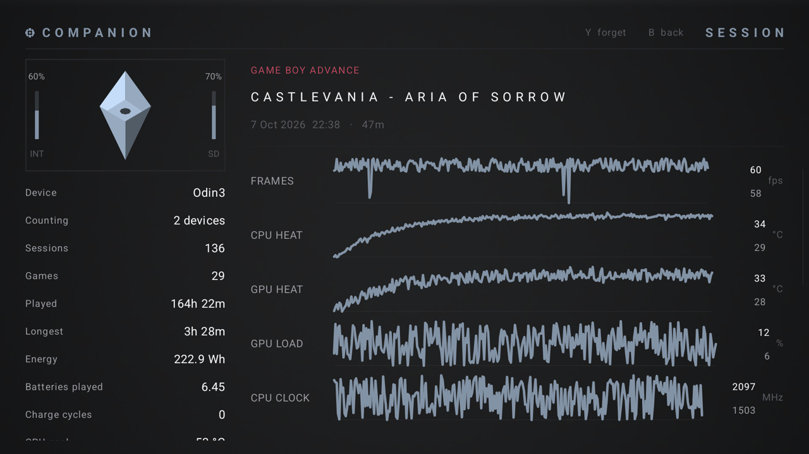
  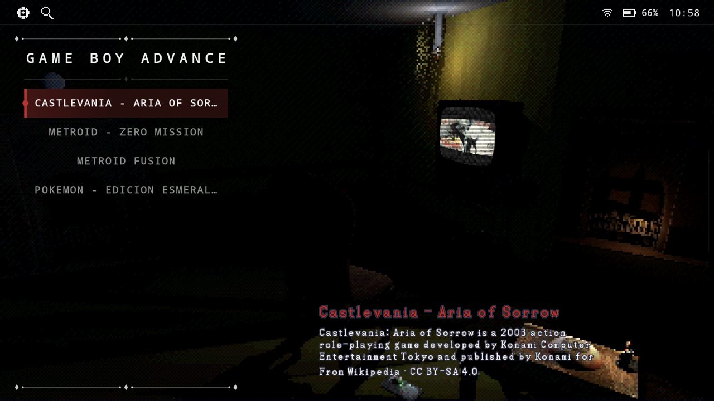

- **Every session, on record.** Time played, battery used, frame rate, temperatures and CPU and
  GPU load, with a graph for each session.
- **Play left on this charge.** Pick a game and Ludolog tells you how long the battery will last
  playing it, learned from your own sessions. The card that shows up when the game starts says it
  too.
- **Battery by game, console and device.** See which games drain the most, and compare your
  handhelds.
- **Battery health** *(experimental)*. How much your battery still holds compared to when it was
  new, and how many charge cycles it has been through.

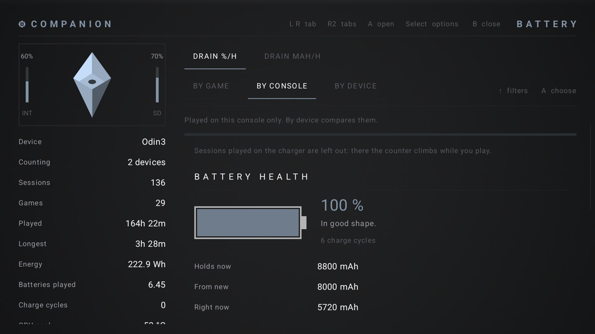

### A character that grows as you play

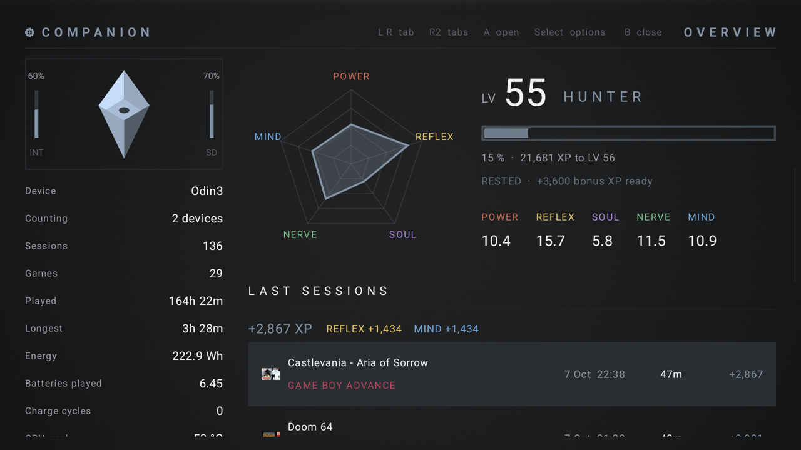

- **Experience is time played.** A break fills a rested bonus that doubles the next minutes; after
  three hours in a row, each minute counts half.
- **Five axes, one class.** Each game feeds POWER, REFLEX, SOUL, NERVE or MIND by its genre. The
  shape of your pentagon gives you a class, and your level goes from 1 to 99.
- **Achievements and missions.** 64 achievements for how you play, from marathons to midnight
  sessions. Track a mission and the games that fit get a mark in the list; finish it for a reward.
- **A card after every game** shows what the session gave you, with a jingle when you level up.

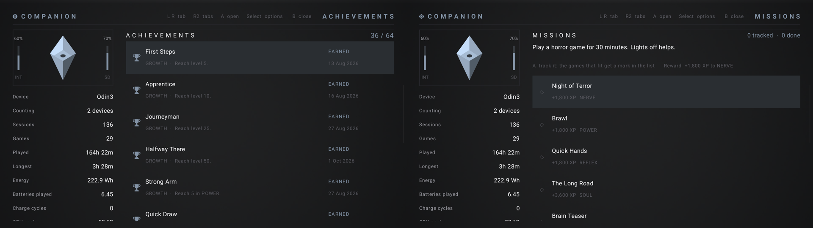

### Light on battery

Ludolog has been tested at length on real handhelds to keep its own battery use low. Animations and
videos rest after 15 seconds without input, nothing plays behind a game or another app, a 30 fps
mode saves more, and a battery saver stops everything that moves on its own.

### Themes that are places

| Parlour | Mainframe | Gallery |
|:---:|:---:|:---:|
| 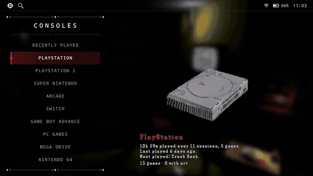 | 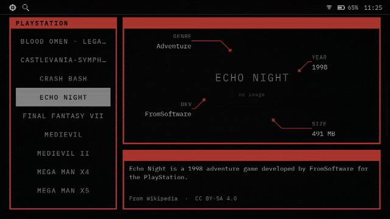 |  |

Each theme has its own look, sounds and spinning consoles. In Parlour your game plays on an old TV
in a dark room; Mainframe is a phosphor terminal that draws the game's cover, its facts and its
video; Gallery is clean and quick. Gallery comes with the app; Parlour and Mainframe are a quick
download from the welcome screen or Settings.

Every theme has nine accent colours to choose from:

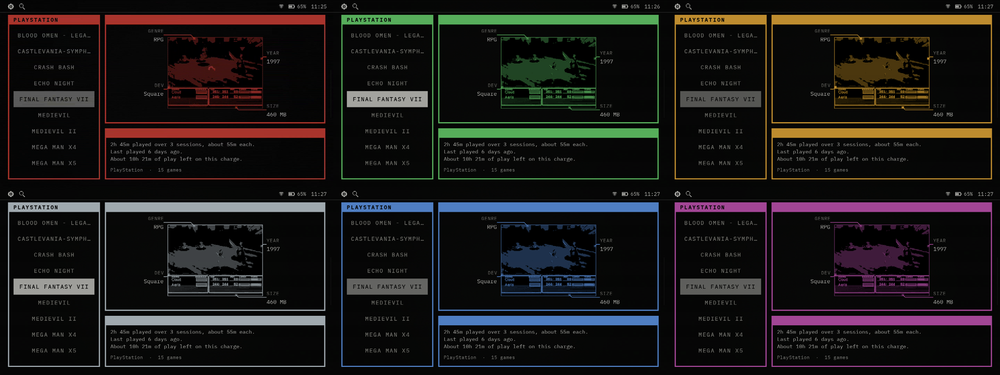

### Your library, recognised

  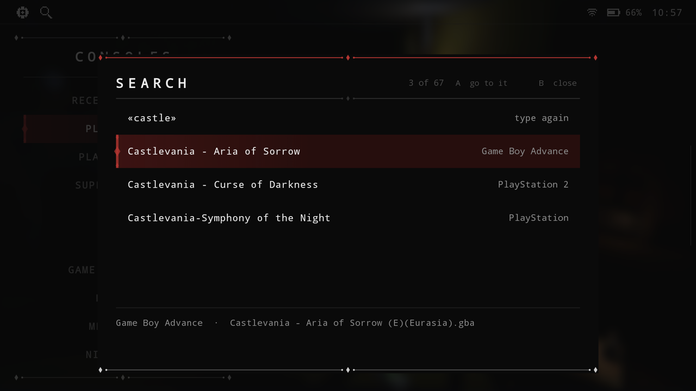
  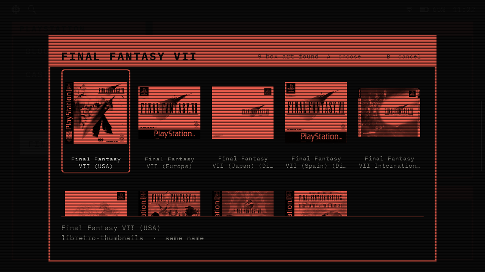

- **Recognised by what's inside.** Games are identified by their contents, not their file name, and
  a free catalog adds the real name, genre, year and story.
- **Box art and gameplay videos** are fetched for you. When more than one could fit, you choose.
- **Find any game** in every console at once with Y, and pick up where you left off from
  *Recently played*.
- **Press A to play.** About 40 emulators are set up, from RetroArch cores to standalone emulators
  and PC game launchers, and you can choose one per console or per game.

### Two screens, your way

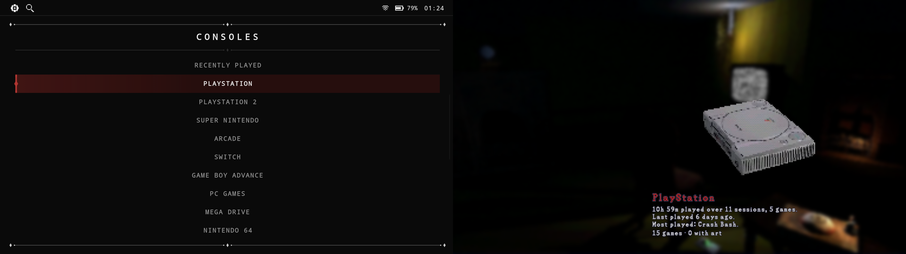

On dual-screen devices, or with a TV or monitor that extends the screen, the list goes on one screen
and the room and the game on the other. *Swap screens* puts the big picture on the TV and the list in
your hands. A game opens on the screen with the picture while Ludolog stays on the other, where you
can keep browsing or open another app; tap a touch screen three times to move the controls across.

### Made for handhelds

Built for a gamepad, works with touch, adapts to any screen shape, and can be your home screen. No
accounts, ads or tracking.

## Better with Ludolog Link

[Ludolog Link](https://github.com/monkikolab/ludolog-link) is an optional add-on for your
handhelds and your Windows PC. Everything goes over your own Wi-Fi: no cables, no accounts, and no
USB debugging or developer options. Pair each device once with a 6-digit code, and that's it.

> [!IMPORTANT]
> For Link to work, your handhelds and your PC must be on the same Wi-Fi network. Use a private
> network you trust, like your home Wi-Fi: what travels between your devices isn't encrypted.

- **Between your handhelds, no PC needed:** your saves follow you from one handheld to the next
  *(experimental)*. Before a game starts, Ludolog brings its newest save from your other devices,
  or warns you if it can't. Every save is backed up first, within a space limit you choose. Games travel over Wi-Fi
  with their box art and video, and your Companion sessions are shared on their own, so every
  device shows the same character.
- **On your PC:** every game on every device in one window. Copy, download and rename them, fix
  their box art and videos, back up your saves and Ludolog's data, and tune each device's settings
  with a keyboard and mouse.

## Install

With [Obtainium](https://github.com/ImranR98/Obtainium) you get each update as soon as it's out. Or
download the APK from the [latest release](https://github.com/monkikolab/ludolog-front-end/releases/latest)
and open it on your device. Ludolog also checks for new versions itself, once a day (you can turn
that off).

## Quick start

1. **Open Ludolog.** The welcome screen walks you through the rest.
2. **Choose where Ludolog keeps its data**: themes, art, settings and the Companion's logbook, all
   in one folder.
3. **Point it at your games**: a folder with one subfolder per console (`snes`, `psx`, `gba`…).
   Pick an empty folder and Ludolog creates them for you.
4. **Pick the extras**: the game catalog, the Parlour and Mainframe themes, gameplay videos, the
   Companion and, if you like, Ludolog Link.
5. **Install your emulators** and press A on a game. To use another one, press Start on the console
   and pick *Choose emulator*.

| Button | What it does |
|---|---|
| A / B | Open or play / go back |
| Y | Search every console |
| Start | The menu of what's selected: favourite, rename, emulator, box art, video |
| Select | Settings |
| L1 / R1 | In a game list, the previous or next console |
| L1 + R1 | Every app on the device |
| L2 + R2 | The Companion |

> [!TIP]
> Make Ludolog your home screen in Settings → Interface → Home app. The shortcuts can be changed in
> Settings → Interface → Shortcuts, and the accent colour in Settings → Theme.

## Compatibility

Android 11 or newer. Ludolog is young: so far it has been tried on an AYN Odin 3 (Android 15) and a
Retroid Pocket 5 (Android 13), with RetroArch, DuckStation, AetherSX2 / NetherSX2, ARMSX3, Dolphin,
PrimeHack, PPSSPP, Azahar, Eden, GameNative, GameHub Lite and DoomForge. Other emulators are set up
but untested. Missing yours, or found a rough edge?
[Open an issue](https://github.com/monkikolab/ludolog-front-end/issues).

<b>More screenshots</b>

 

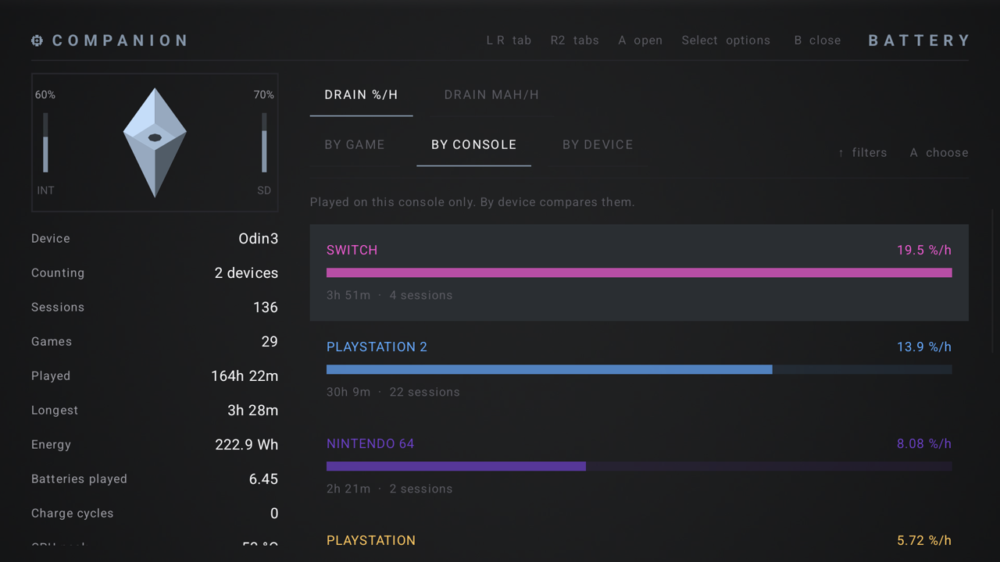

## Privacy

Ludolog has no accounts, ads, analytics or tracking. It goes online only for:

- **GitHub**, to download the game catalog and the themes from this project's releases, and to
  check for a newer Ludolog (this can be turned off in Settings, Data).
- **Box art and videos**: libretro-thumbnails, GameTDB, the Steam store (for PC games) and
  gameplay-video collections on archive.org. Only the game's name or ID is sent.
- **IGDB**, only if you add your own keys. They are kept encrypted on the device.

Your settings, art and logbook stay in Ludolog's folder on your device. Ludolog Link, if you use
it, talks only to your own devices and PC on your local network. The diagnostics file is saved to
Download for you to attach to a bug report; nothing is sent on its own.

## Support the project

Ludolog is free, made in spare time. If you'd like to help it keep growing (more themes, more
emulators, more devices tested), you can buy me a coffee on
**[Ko-fi](https://ko-fi.com/monkikolab)**. Bug reports and feedback help just as much.

## AI assistance disclosure

AI assistance was used while building this project. I reviewed the code throughout development and
understand how the app works and what it does.

## License

[GPL-3.0](https://www.gnu.org/licenses/gpl-3.0.html). See also [NOTICE](NOTICE.md).
For developers: [building from source and technical notes](docs/README.md).
